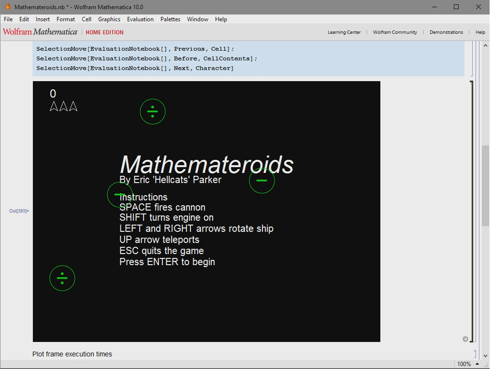

Code samples from Eric Parker
===

## PriorityQueue.h
A templated C++ class implementing a priority queue.
The C++ standard library provides a basic priority queue implementation, but this class adds the ability to remove arbitrary items or to change the priority of items after they have been inserted.
It also provides an indexing operator and an efficient callback mechanism for receiving notification when an item's index has changed.

```C++
template <class T, class Compare = std::less<T>, class Moved = NoMove<T> >
class PriorityQueue;
```

|Template Argument|Purpose|
|:--:|--|
|T| Type of items stored in container
|Compare| type used to perform comparisons between items
|Moved| type notified when an item changes index

## Etch.cpp
This is a snippet from a much larger file that performs anisotropic Si crystal atomistic etch simulation as part of the [SEMulator3D](https://www.coventor.com/semiconductor-solutions/semulator3d/) product from Coventor.
Atomistic etch simulation is based on a probabilistic function of the neighbors around each atom in the crystal structure. 
Single crystal silicon forms a repeating [diamond cubic](https://en.wikipedia.org/wiki/Diamond_cubic) structure.
Computing the neighborhood  around an atom is a performance bottleneck for the simulation algorithm.

For maximum performance, I wanted to hard-code the neighbor calculations based on the location of an atom within the repeating diamond unit cell.
But the number of combinations of atom index and neighbor index leads to a combinatoric explosion of cases, and getting all the indices correct would be both time consuming and error prone.

To solve this problem, I used a source-code generation tool that I developed several years ago called *gen*.
Gen supports both Python and C# as scripting languages.
The basic technique is to embed script code within the *if* portion of a false `#if` block, with the generated code being inserted into the true *else* portion.
Here's a simple example using Python as the scripting language

```C++
#if PYGEN
<%for i in range(5):
%>  printf("index is <%=i%>\n"); 
#endif
```
and after running *gen*:
```C++
#if PYGEN
<%for i in range(5):
%>  printf("index is <%=i%>\n"); 
#else
    printf("index is 0\n");
    printf("index is 1\n");
    printf("index is 2\n");
    printf("index is 3\n");
    printf("index is 4\n");
#endif
```
The symbol `PYGEN` is never defined, so the regular C++ compiler ignores the Python code and just sees the generated code.
The basic idea should be familiar  to anyone who has worked with web technologies such as ASP, Flask, JSP etc. where html pages are intermingled with templated script code.

I usually assign the generator to a key sequence in Visual Studio so I can just write some script and hit a key to have the code generated.
The file is then just checked into source control as usual so the generator isn't part of the automated build process, so it is very unobtrusive.

## Mathemateroids
Mathemateroids is an implementation of Asteroids in *Mathematica* using my DuckSOOP object-oriented framework.



(Also see this [video](mathemateroids/gameplay.webm) which can be opened in Chrome)

The code comprises a simple game engine (sceneManager.m, gameObject.m, interfaces.m, transform.m) and the Mathemateroids game itself (mathemateroids.m, alien.m, bullets.m, dust.m, score.m, ship.m, sprite.m, staticGraphics.m).

The game loop is implemented as a single `Dynamic[]` using a `Pause[]` to wait until the start of the next frame.
*Mathematica* provides only rudimentary media and input/output extensions (for instance, an audio mixer is not included), so I had to use some trickery to even get the game somewhat playable.
This represents about the limit of what can be done with real-time Mathematica code, so it is in no sense practical.
But its a fun example of how to use the DuckSOOP framework.